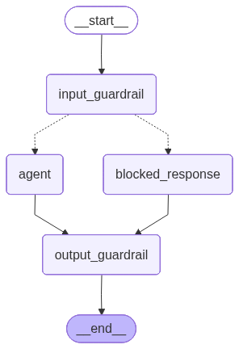

# CityPark Parking Reservation Chatbot

An intelligent parking reservation chatbot built with **LangChain**, **LangGraph**, and **Retrieval-Augmented Generation (RAG)**. The system uses a **ReAct agent** that can answer questions about the parking facility and collect reservation data conversationally, backed by **Weaviate** for semantic search and **PostgreSQL** for live data.

---

## Architecture



The **agent** is a LangGraph ReAct agent (`langchain.agents.create_agent`) with three tools:

| Tool | Purpose |
|------|---------|
| `retrieve_parking_info` | Hybrid retrieval: semantic search (Weaviate) + live SQL data (prices, availability, hours) |
| `get_reservation_draft` | Read current reservation fields from state |
| `update_reservation_draft` | Persist collected fields into state as the user provides them |

### Hybrid Retrieval

| Data type | Storage | Examples |
|-----------|---------|---------|
| **Static** | Weaviate (vector search) | Location, amenities, policies, FAQ, booking guide |
| **Dynamic** | PostgreSQL (SQL queries) | Prices, space availability, working hours |

---

## Project Structure

```
parking-reservation-bot/
├── main.py                      # CLI entry point
├── docker-compose.yml           # Weaviate + PostgreSQL
├── requirements.txt
├── .env.example
├── data/
│   ├── static/
│   │   └── parking_info.md      # Source document (loaded into Weaviate)
│   └── seeds/
│       └── init_db.sql          # PostgreSQL schema + seed data (150 spaces)
├── src/
│   ├── config.py                # Pydantic-settings configuration
│   ├── database/
│   │   ├── vector_store.py      # Weaviate client & ingestion
│   │   └── sql_store.py         # PostgreSQL queries (prices, availability, reservations)
│   ├── rag/
│   │   ├── retriever.py         # Hybrid retriever (Weaviate + PostgreSQL)
│   │   └── chain.py             # RAG answer generation chain
│   ├── chatbot/
│   │   ├── state.py             # AgentState (MessagesState + reservation_data + guardrail flags)
│   │   ├── tools.py             # ReAct agent tools
│   │   ├── agent.py             # create_agent() setup with system prompt
│   │   ├── nodes.py             # Guardrail node functions
│   │   └── graph.py             # Outer graph assembly & chat() helper
│   ├── guardrails/
│   │   └── filters.py           # Presidio-based PII detection & output sanitisation
│   └── evaluation/
│       └── metrics.py           # Precision@K, Recall@K, latency, LLM-as-judge
├── scripts/
│   ├── ingest_data.py           # Load static data into Weaviate
│   └── evaluate.py              # RAG evaluation suite
└── tests/
    ├── conftest.py
    ├── test_chatbot.py          # Guardrail nodes + agent tools
    ├── test_guardrails.py
    ├── test_retriever.py
    ├── test_vector_store.py
    ├── test_sql_store.py
    └── test_evaluation.py
```

---

## Quick Start

### Prerequisites

- Python 3.11+
- Make
- Docker & Docker Compose
- OpenAI API key

### 1. Install dependencies

```bash
make init
```

Creates `.venv`, installs packages, and downloads the spaCy NER model.

### 2. Configure environment

```bash
cp .env.example .env
# Fill in OPENAI_API_KEY and LANGSMITH_API_KEY (optional)
```

### 3. Start services & ingest data

```bash
make up      # Start Weaviate + PostgreSQL
make ingest  # Chunk parking_info.md and load into Weaviate
```

Or to wipe and rebuild everything from scratch:

```bash
make reset   # down -v → up → ingest (waits for Weaviate to be ready)
```

### 4. Run the chatbot

```bash
make chat
```

---

## Make Commands

| Command | Description |
|---------|-------------|
| `make init` | Create virtualenv and install dependencies |
| `make up` | Start Docker services (Weaviate + PostgreSQL) |
| `make down` | Stop Docker services (keep data) |
| `make reset` | Full wipe and reinitialise (down -v → up → ingest) |
| `make ingest` | Load static parking data into Weaviate |
| `make chat` | Run the chatbot CLI |
| `make test` | Run unit tests (no live services needed) |
| `make evaluate` | Run RAG evaluation suite (requires live services) |
| `make graph` | Render graph topology to `graph.png` |

---

## Running Tests

```bash
make test
```

Unit tests mock all external services (Weaviate, PostgreSQL, OpenAI) — no Docker required.

---

## Running the Evaluation Suite

Requires live Docker services and ingested data:

```bash
make evaluate

# Skip LLM-as-judge (faster/cheaper)
make evaluate NO_LLM_JUDGE=1

# Save results to JSON
make evaluate OUTPUT=evaluation_report.json
```

### Metrics

| Metric | Description |
|--------|-------------|
| **Precision@K** | Fraction of retrieved chunks that are relevant |
| **Recall@K** | Fraction of relevant chunks that were retrieved |
| **Hit Rate@K** | Whether any relevant chunk appears in top-K |
| **Faithfulness** | LLM judge: does the answer stay within the retrieved context? |
| **Answer Relevance** | LLM judge: is the answer on-point for the question? |
| **Latency p50/p95/p99** | End-to-end response time percentiles (ms) |

---

## Guardrails

| Layer | What it checks | Action on detection |
|-------|---------------|-------------------|
| **Input** | Credit cards, SSNs, IBANs in user message | Block message, return safe refusal |
| **Output** | Sensitive financial data in generated reply | Replace reply with privacy notice |

Powered by [Microsoft Presidio](https://github.com/microsoft/presidio) with `en_core_web_lg` spaCy model.

---

## LangSmith Tracing

Set the following in `.env` to enable tracing:

```env
LANGSMITH_API_KEY=lsv2_...
LANGSMITH_TRACING_V2=true
LANGSMITH_PROJECT=parking-reservation-bot
LANGSMITH_ENDPOINT=https://api.smith.langchain.com
```

---

## Environment Variables

| Variable | Default | Description |
|----------|---------|-------------|
| `OPENAI_API_KEY` | — | **Required** |
| `OPENAI_CHAT_MODEL` | `gpt-4o` | LLM for agent reasoning |
| `OPENAI_EMBEDDING_MODEL` | `text-embedding-3-small` | Embedding model for Weaviate |
| `WEAVIATE_HOST` | `localhost` | Weaviate host |
| `WEAVIATE_PORT` | `8080` | Weaviate HTTP port |
| `WEAVIATE_GRPC_PORT` | `50051` | Weaviate gRPC port |
| `WEAVIATE_COLLECTION_NAME` | `ParkingInfo` | Weaviate collection |
| `POSTGRES_HOST` | `localhost` | PostgreSQL host |
| `POSTGRES_PORT` | `5432` | PostgreSQL port |
| `POSTGRES_DB` | `parking_db` | Database name |
| `POSTGRES_USER` | `parking_user` | DB username |
| `POSTGRES_PASSWORD` | `parking_password` | DB password |
| `RETRIEVAL_K` | `4` | Number of vector search results |
| `CHUNK_SIZE` | `450` | Document chunk size (characters) |
| `CHUNK_OVERLAP` | `70` | Chunk overlap (characters) |
